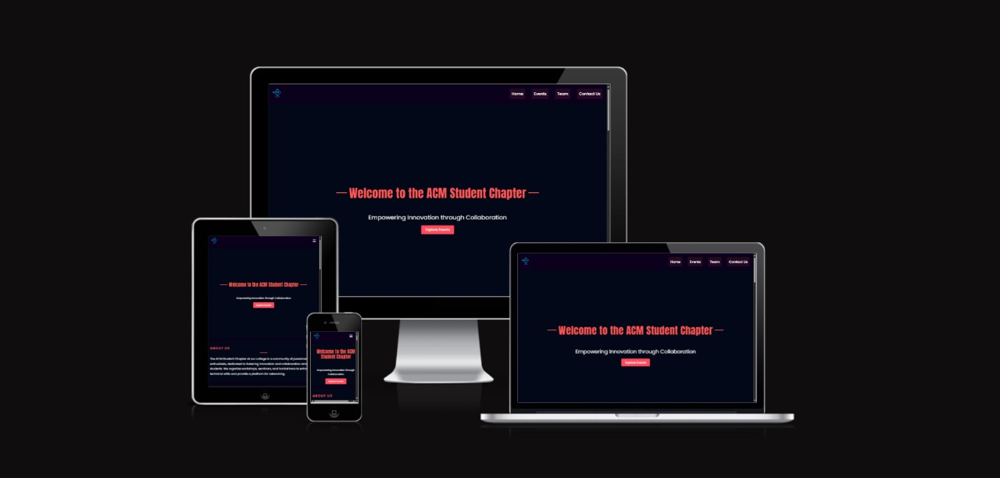

<p align="center">
  
</p>

# ACM - NMAMIT Club Website

Welcome to the official repository for the **ACM - NMAMIT Club** website. This site serves as a hub for our club activities, events, and information about our core members. Built with **Vite** and **React**, it provides a fast and engaging user experience, enhanced by animations.

## Table of Contents
- [Overview](#overview)
- [Features](#features)
- [Technologies Used](#technologies-used)
- [Getting Started](#getting-started)
- [Project Structure](#project-structure)
- [How to Contribute](#how-to-contribute)
- [License](#license)

## Overview
The ACM - NMAMIT Club website is designed to inform students about club events, introduce core members, and provide a platform for contact and inquiries. The website is fully responsive and incorporates smooth animations to enhance user interaction.

## Features
- **Responsive Design**: Fully responsive layout for accessibility on all devices.
- **Dynamic Routing**: Utilizes React Router for seamless navigation between pages.
- **Core Members Showcase**: Dedicated page to introduce our club's core members.
- **Events Page**: A calendar of upcoming events and activities.
- **Contact Form**: Allows users to get in touch with the club for inquiries.
- **Animations**: Engaging animations that enhance the user experience.

## Technologies Used
- **Frontend**:
  - **React**: JavaScript library for building user interfaces.
  - **Vite**: A build tool that significantly improves the development experience.
  - **CSS**: Styles for layout and design, with optional animations.
  - **Font Awesome**: Icon library for adding visual elements.
  
- **Routing**:
  - **React Router**: For dynamic routing and navigation between pages.

## Getting Started
To get a local copy of the project up and running, follow these steps:

### Prerequisites
Make sure you have the following installed:
- **Node.js** (v12 or later)
- **npm** (Node Package Manager)

### Installation
1. Clone the repository:
   ```bash
   git clone https://github.com/your-username/acm-nmam-it-club-website.git
   cd acm-nmam-it-club-website
### Install the dependencies:
npm install


/acm-nmam-it-club-website/
├── src/
│   ├── App.js                # Main application file
│   ├── index.js              # Entry point for React
│   ├── pages/
│   │   ├── Home.js           # Home page component
│   │   ├── Events.js         # Events page component
│   │   ├── CoreMembers.js     # Core Members page component
│   │   └── Contact.js         # Contact page component
│   ├── components/
│   │   ├── Navbar.js          # Navbar component
│   │   └── Footer.js          # Footer component
│   ├── App.css                # Global styles
│   └── ...                    # Additional components and assets
└── README.md                 # Project documentation (you are here)
### License
**This project is licensed under the MIT License.**

